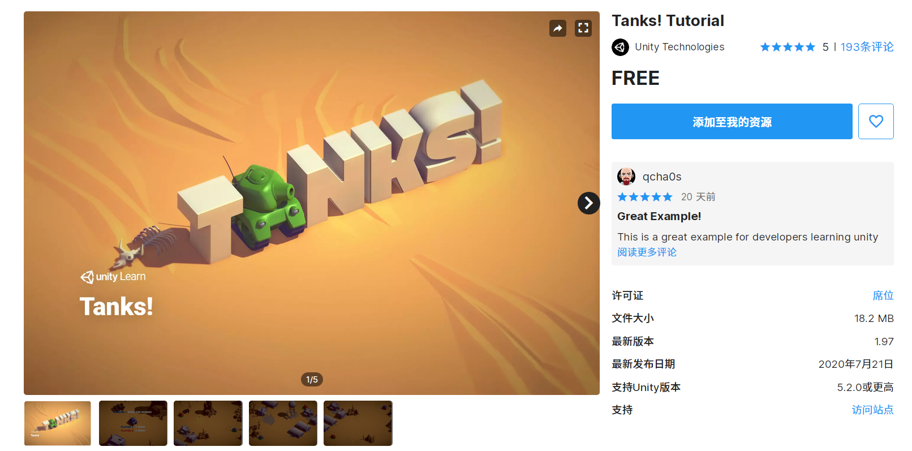
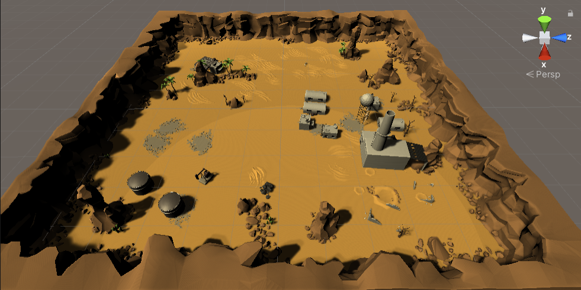

# 3D游戏设计读书笔记十
## 以下作业二选一
1.有趣 AI 小游戏制作，不限于以下范围<br>
- 让事物具有学习功能，经过不同训练可以达到不同效果。如健身达人
- 利用机器学习或人工智能算法实现学习的创新游戏场景片段
- 利用在线语音识别或人脸识别等AI服务的创新游戏场景片段

2.坦克对战游戏 AI 设计<br>
从商店下载游戏：“Kawaii” Tank 或 其他坦克模型，构建 AI 对战坦克。具体要求<br>
- 使用“感知-思考-行为”模型，建模 AI 坦克
- 场景中要放置一些障碍阻挡对手视线
- 坦克需要放置一个矩阵包围盒触发器，以保证 AI 坦克能使用射线探测对手方位
- AI 坦克必须在有目标条件下使用导航，并能绕过障碍。（失去目标时策略自己思考）
- 实现人机对战

## 坦克对战游戏 AI 设计
### 一、下载资源
从Asset Store中下载并导入资源"tanks tutorial"：<br>

该资源包里包含了草木等各式各样的元素，我们可以通过自己的喜好来构造属于自己的地图：<br>

下面是我参考设计的地图，做完后把它设为预置：<br>

### 二、代码设计
#### 1.Tank 坦克类 坦克分为两类：玩家和敌人。坦克类包含坦克的血量、移动和攻击：
```csharp
using System.Collections;
using System.Collections.Generic;
using UnityEngine;

public class Tank : MonoBehaviour {
    private float hp =500.0f;
    // 初始化
    public Tank()
    {
        hp = 500.0f;
    }

    public float getHP()
    {
        return hp;
    }

    public void setHP(float hp)
    {
        this.hp = hp;
    }

    public void beShooted()
    {
        hp -= 100;
    }
    
    public void shoot(TankType type)
    {
        GameObject bullet = Singleton<MyFactory>.Instance.getBullets(type);
        bullet.transform.position = new Vector3(transform.position.x, 1.5f, transform.position.z) + transform.forward * 1.5f;
        bullet.transform.forward = transform.forward; //方向
        bullet.GetComponent<Rigidbody>().AddForce(bullet.transform.forward * 20, ForceMode.Impulse);
    }
}
```
#### 2.MyFactory 游戏工厂
本次坦克游戏使用工厂模式来控制游戏对象的生成和回收利用，以此实现对资源的合理控制。游戏中，敌方坦克(Enemy)和子弹(Bullet)都可以用工厂进行生产和回收。方法还是一样，维护两个列表，一个存储当前游戏场景中的游戏对象，一个存储空闲的(可直接实例化)的游戏对象。
```csharp
using System.Collections;
using System.Collections.Generic;
using UnityEngine;

public enum TankType { PLAYER , ENEMY};
public class MyFactory : MonoBehaviour {

    public GameObject player;
    public GameObject enemy;
    public GameObject bullet;
    public ParticleSystem explosion;

    private List<GameObject> usingTanks;
    private List<GameObject> freeTanks;
    private List<GameObject> usingBullets;
    private List<GameObject> freeBullets;
    private GameObject role;
    private List<ParticleSystem> particles;

    private void Awake()
    {
        usingTanks = new List<GameObject>();
        freeTanks = new List<GameObject>();
        usingBullets = new List<GameObject>();
        freeBullets = new List<GameObject>();
        particles = new List<ParticleSystem>();

        role = GameObject.Instantiate<GameObject>(player) as GameObject;
        role.SetActive(true);
        role.transform.position = Vector3.zero;
    }
    // Use this for initialization
    void Start () {
        Enemy.recycleEnemy += recycleEnemy;
    }
	
	// Update is called once per frame
	public GameObject getPlayer()
    {      
        return role;
    }

    public GameObject getEnemys()
    {
        GameObject newTank = null;
        if (freeTanks.Count <= 0)
        {
            newTank = GameObject.Instantiate<GameObject>(enemy) as GameObject;
            usingTanks.Add(newTank);
            newTank.transform.position = new Vector3(Random.Range(-100, 100), 0, Random.Range(-100, 100));
        }
        else
        {
            newTank = freeTanks[0];
            freeTanks.RemoveAt(0);
            usingTanks.Add(newTank);
        }
        newTank.SetActive(true);
        return newTank;
    }

    public GameObject getBullets(TankType type)
    {
        GameObject newBullet;
        if(freeBullets.Count <= 0)
        {
            newBullet = GameObject.Instantiate<GameObject>(bullet) as GameObject;
            usingBullets.Add(newBullet);
            newBullet.transform.position = new Vector3(Random.Range(-100, 100), 0, Random.Range(-100, 100));
        }
        else
        {
            newBullet = freeBullets[0];
            freeBullets.RemoveAt(0);
            usingBullets.Add(newBullet);
        }
        newBullet.GetComponent<Bullet>().setTankType(type);
        newBullet.SetActive(true);
        return newBullet;
    }

    public ParticleSystem getParticleSystem()
    {
        foreach(var particle in particles)
        {
            if (!particle.isPlaying)
            {
                return particle;
            }
        }
        ParticleSystem newPS = GameObject.Instantiate<ParticleSystem>(explosion);
        particles.Add(newPS);
        return newPS;
    }

    public void recycleEnemy(GameObject enemyTank)
    {
        usingTanks.Remove(enemyTank);
        freeTanks.Add(enemyTank);
        enemyTank.GetComponent<Rigidbody>().velocity = Vector3.zero;
        enemyTank.SetActive(false);
    }

    public void recycleBullet(GameObject Bullet)
    {
        usingBullets.Remove(Bullet);
        freeBullets.Add(Bullet);
        Bullet.GetComponent<Rigidbody>().velocity = Vector3.zero;
        Bullet.SetActive(false);
    }
}

```
#### 3.Player 玩家类
本类主要实现玩家坦克受键盘键入的控制。为了增强游戏可玩性，我们也可以进行一些设置，比如玩家的血量比敌方坦克多，比如玩家的移动速度较快，比如玩家的子弹伤害更高等等。
```csharp
using System.Collections;
using System.Collections.Generic;
using UnityEngine;

public class Player : Tank{
    // player被摧毁时发布信息；
    public delegate void DestroyPlayer();
    public static event DestroyPlayer destroyEvent;
    void Start () {
        setHP(500);
	}
	
	// Update is called once per frame
	void Update () {
		if(getHP() <= 0)    // Tank is destoryed
        {
            this.gameObject.SetActive(false);
            destroyEvent();
        }
	}

    //向前移动
    public void moveForward()
    {
        gameObject.GetComponent<Rigidbody>().velocity = gameObject.transform.forward * 20;
    }
    //向后移动
    public void moveBackWard()
    {
        gameObject.GetComponent<Rigidbody>().velocity = gameObject.transform.forward * -20;
    }

    //通过水平轴上的增量，改变玩家坦克的欧拉角，从而实现坦克转向
    public void turn(float offsetX)
    {
        float x = gameObject.transform.localEulerAngles.x;
        float y = gameObject.transform.localEulerAngles.y + offsetX*2;
        gameObject.transform.localEulerAngles = new Vector3(x, y, 0);
    }
}

```
#### 4.Enemy 敌方坦克类
敌方坦克的主要行为有两个，一是自动寻路，寻找玩家；二是攻击玩家。实现的思路是，给敌方坦克提供全局的视野，只要游戏尚未结束，敌方坦克就一直朝着玩家的方向移动；当敌方坦克和玩家的距离小于某值，敌方坦克开炮。同时，如果敌方坦克受到攻击后血量低于0，则通知游戏工厂进行回收。
```csharp
using System.Collections;
using System.Collections.Generic;
using UnityEngine;
using UnityEngine.AI;

public class Enemy : Tank {
    public delegate void RecycleEnemy(GameObject enemy);
    //当enemy被摧毁时，通知工厂回收；
    public static event RecycleEnemy recycleEnemy;
    // player 的位置
    private Vector3 playerLocation;
    //游戏是否结束
    private bool gameover;
    private void Start()
    {
        playerLocation = GameDirector.getInstance().currentSceneController.getPlayer().transform.position;
        StartCoroutine(shoot());
    }

    void Update() {
        playerLocation = GameDirector.getInstance().currentSceneController.getPlayer().transform.position;
        gameover = GameDirector.getInstance().currentSceneController.getGameOver();
        if (!gameover)
        {
            if (getHP() <= 0 && recycleEnemy != null)
            {
                recycleEnemy(this.gameObject);
            }
            else
            {
                // 自动向player移动
                NavMeshAgent agent = gameObject.GetComponent<NavMeshAgent>();
                agent.SetDestination(playerLocation);
            }
        }
        else
        {
            //游戏结束，停止寻路
            NavMeshAgent agent = gameObject.GetComponent<NavMeshAgent>();
            agent.velocity = Vector3.zero;
            agent.ResetPath();
        }
    }
    IEnumerator shoot()
    {
        while (!gameover)
        {
            for(float i = 1;i> 0; i -= Time.deltaTime)
            {
                yield return 0;
            }
            if(Vector3.Distance(playerLocation,gameObject.transform.position) < 14)
            {
                shoot(TankType.ENEMY);
            }
        }
    }
}

```
#### 5.Bullet 子弹类
子弹射中目标是通过碰撞检测来实现的。需要注意的一点是，我们应当区分子弹的发射者，这样做有以下好处：<br>首先，我们可以使得敌方坦克的子弹不会误伤自己阵营的坦克；<br>其次，我们可以调整玩家和敌方坦克的子弹伤害值。
```csharp
using System.Collections;
using System.Collections.Generic;
using UnityEngine;

public class Bullet : MonoBehaviour {
    public float explosionRadius = 3.0f;
    private TankType tankType;

    //设置发射子弹的坦克类型
    public void setTankType(TankType type)
    {
        tankType = type;
    }
    private void OnCollisionEnter(Collision collision)
    {
        if(collision.transform.gameObject.tag == "tankEnemy" && this.tankType == TankType.ENEMY ||
            collision.transform.gameObject.tag == "tankPlayer" && this.tankType == TankType.PLAYER)
        {
            return;
        }
        MyFactory factory = Singleton<MyFactory>.Instance;
        ParticleSystem explosion = factory.getParticleSystem();
        explosion.transform.position = gameObject.transform.position;
        //获取爆炸范围内的所有碰撞体
        Collider[] colliders = Physics.OverlapSphere(gameObject.transform.position, explosionRadius);
        
        foreach(var collider in colliders)
        {
            //被击中坦克与爆炸中心的距离
            float distance = Vector3.Distance(collider.transform.position, gameObject.transform.position);
            float hurt;
            // 如果是玩家发出的子弹伤害高一点
            if (collider.tag == "tankEnemy" && this.tankType == TankType.PLAYER)
            {
                hurt = 300.0f / distance;
                collider.GetComponent<Tank>().setHP(collider.GetComponent<Tank>().getHP() - hurt);
            }
            else if(collider.tag == "tankPlayer" && this.tankType == TankType.ENEMY)
            {
                hurt = 100.0f / distance;
                collider.GetComponent<Tank>().setHP(collider.GetComponent<Tank>().getHP() - hurt);
            }
            explosion.Play();
        }

        if (gameObject.activeSelf)
        {
            factory.recycleBullet(gameObject);
        }
    }

}

```
#### 6.SceneController 场记
场记做的主要是初始化以及信息的传递。具体来说，场记产生坦克，传递玩家位置信息、传递游戏状态、传递玩家的控制信息(通过调用Player类的移动或攻击函数)。
```csharp
using System.Collections;
using System.Collections.Generic;
using UnityEngine;

public class SceneController : MonoBehaviour,IUserAction{
    public GameObject player;
    private int enemyCount = 6;
    private bool gameOver = false;
    private GameObject[] enemys;
    private MyFactory myFactory;
    public GameDirector director;
    private void Awake()
    {
        director = GameDirector.getInstance();
        director.currentSceneController = this;
        enemys = new GameObject[enemyCount];
        gameOver = false;
        myFactory = Singleton<MyFactory>.Instance;
       
    }
   
    void Start () {
        player = myFactory.getPlayer();
        for (int i = 0; i < enemyCount; i++)
        {
            enemys[i]=myFactory.getEnemys();
        }
        Player.destroyEvent += setGameOver;
    }
	
	// Update is called once per frame
	void Update () {
        Camera.main.transform.position = new Vector3(player.transform.position.x, 18, player.transform.position.z);
    }

    //返回玩家坦克的位置
    public GameObject getPlayer()
    {
        return player;
    }

    //返回游戏状态
    public bool getGameOver()
    {
        return gameOver;
    }

    //设置游戏结束
    public void setGameOver()
    {
        gameOver = true;
    }

    public void moveForward()
    {
        player.GetComponent<Player>().moveForward();
    }
    public void moveBackWard()
    {
        player.GetComponent<Player>().moveBackWard();
    }

    //通过水平轴上的增量，改变玩家坦克的欧拉角，从而实现坦克转向
    public void turn(float offsetX)
    {
        player.GetComponent<Player>().turn(offsetX);
    }

    public void shoot()
    {
        player.GetComponent<Player>().shoot(TankType.PLAYER);
    }

}

```
#### 7.IUserGUI 用户交互类
主要实现接收玩家的键入，以及显示游戏状态(游戏结束时显示"Game Over!")：
```csharp
using System.Collections;
using System.Collections.Generic;
using UnityEngine;

public class IUserGUI : MonoBehaviour {
    IUserAction action;

	// Use this for initialization
	void Start () {
        action = GameDirector.getInstance().currentSceneController as IUserAction;
	}
	
	// Update is called once per frame
	void Update () {
        if (!action.getGameOver())
        {
            if (Input.GetKey(KeyCode.W))
            {
                action.moveForward();
            }

            if (Input.GetKey(KeyCode.S))
            {
                action.moveBackWard();
            }

           
            if (Input.GetKeyDown(KeyCode.Space))
            {
                action.shoot();
            }
            //获取水平轴上的增量，目的在于控制玩家坦克的转向
            float offsetX = Input.GetAxis("Horizontal");
            action.turn(offsetX);
        }
    }

    void OnGUI()
    {
        //gameover时生成提示
        if (action.getGameOver())
        {
            GUIStyle fontStyle = new GUIStyle();
            fontStyle.fontSize = 30;
            fontStyle.normal.textColor = new Color(0, 0, 0);
            GUI.Button(new Rect(Screen.width/2-50, Screen.height/2-50, 200, 50), "GameOver!");
        }
    }
}

```
#### 视频演示与代码
[视频演示](https://www.bilibili.com/video/BV17V411b7Dg/)<br>