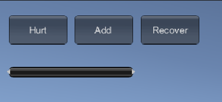
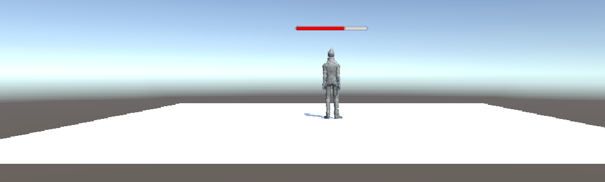
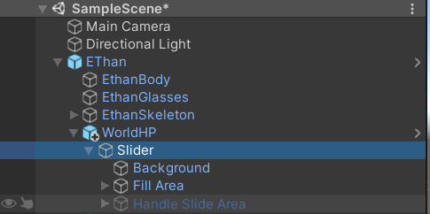
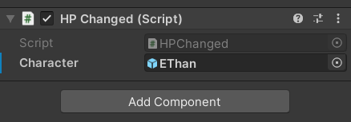

# 3D游戏设计读书笔记九
本次作业五选一，我选择制作血条预制设计，要求如下：
- 分别使用 IMGUI 和 UGUI 实现
- 使用 UGUI，血条是游戏对象的一个子元素，任何时候需要面对主摄像机
- 分析两种实现的优缺点
- 给出预制的使用方法

首先我们为人物挂上一个Health的组件，上面记录着当前的血量和总血量，以及伤害、加血和恢复的调用函数。
```javascript
using System.Collections;
using System.Collections.Generic;
using UnityEngine;

namespace HealthBar
{
    public class Health : MonoBehaviour
    {
        public float curHP;
        public float nextHP;
        public float fullHP = 100.0f;

        private void Start() {
            curHP = fullHP;
            nextHP = fullHP;
        }
        private void Update() {
            //Linear interpolation to make HP change smoothly
            curHP = Mathf.Lerp(curHP, nextHP, 0.05f);
        }
        public void Hurt(){
            nextHP = (curHP - 10.0f)>=0f?curHP-10.0f:0.0f;
        }
        public void Recover(){
            nextHP = fullHP;
        }
        public void Add(){
            nextHP = (curHP + 10.0f)<=100.0f?curHP+10.0f:100.0f;
        }
    }   
}
```
## IMGUI实现
用水平滚动条的宽度作为血条的显示值，使用一个临时变量curHP记录变化的血值，通过三个Button实现对血值的修改。
```javascript
using System.Collections;
using System.Collections.Generic;
using UnityEngine;

namespace HealthBar{
    [RequireComponent(typeof(Health))]
    public class IMGUI : MonoBehaviour
    {
        private GameObject Character;
        private float curHP;
        private float fullHP;
        private void Start() {
            Character = this.gameObject;
        }

        private void OnGUI() {
            if(GUI.Button(new Rect(20,20,80,40),"Hurt"))
            {
                Character.GetComponent<Health>().Hurt();
            }
            if(GUI.Button(new Rect(110,20,80,40),"Add"))
            {
                Character.GetComponent<Health>().Add();
            }
            if(GUI.Button(new Rect(200,20,80,40),"Recover"))
            {
                Character.GetComponent<Health>().Recover();
            }

            //Linear interpolation to make HP change smoothly
            curHP = Character.GetComponent<Health>().curHP;
            fullHP = Character.GetComponent<Health>().fullHP;

            GUI.HorizontalScrollbar(new Rect(20,90,170,20), 0.0f, curHP, 0.0f, fullHP);
        }
    }
}
```
将以上代码挂载到人物身上即可。完成后将该对象做成预制，效果如下：


## UGUI实现
按照课件中所描述的该方法的具体实现，在其基础上做一些修改即可。

1. 菜单 Assets -> Import Package -> Characters 导入资源
2. 在层次视图，Context 菜单 -> 3D Object -> Plane 添加 Plane 对象
3. 资源视图展开 Standard Assets :: Charactors :: ThirdPersonCharater :: Prefab
4. 将 ThirdPersonController 预制拖放放入场景，改名为 Ethan
5. 检查以下属性
Plane 的 Transform 的 Position = (0,0,0)
Ethan 的 Transform 的 Position = (0,0,0)
Main Camera 的 Transform 的 Position = (0,1,-10)
6. 选择 Ethan 用Component -> UI -> Canvas, 添加画布子对象
7. 选择 Ethan 的 Canvas，用Component -> UI -> Slider 添加滑条作为血条子对象
8. 选择 Ethan 的 Canvas，在 Inspector 视图
（1) 设置 Canvas 组件 Render Mode 为 World Space
（2) 设置 Rect Transform 组件 (PosX，PosY，Width， Height) 为 (0,2,160,20)
 （3) 设置 Rect Transform 组件 Scale （x,y） 为 (0.01,0.01)
9. 展开 Slider
(1) 选择 Handle Slider Area，禁止（disable）该元素
(2) 选择 Background，禁止（disable）该元素
(3) 选择 Fill Area 的 Fill，修改 Image 组件的 Color 为 红色
10. 选择 Slider 的 Slider 组件
(1) 设置 MaxValue 为 100
(2) 设置 Value 为 75

使血条一直朝向摄像机，将以下脚本添加到Canvas中：
```javascript
using UnityEngine;

namespace LookAtCamera{
    public class LookAtCamera : MonoBehaviour 
    {
        void Update () 
        {
            this.transform.LookAt (Camera.main.transform.position);
        }
    }
}
```
结果如下：<br>

## 分析两种实现的优缺点
看了一下网上的观点，感觉都差不多，自己也觉得蛮符号我的想法，就照着网上的来了：
### IMGUI
IMGUI（Immediate Mode GUI）及时模式图形界面。它是代码驱动的 UI 系统，没有图形化设计界面，只能在 OnGUI 阶段用 GUI 系列的类绘制各种 UI 元素，因此 UI元素只能浮在游戏界面之上。

IMGUI 的存在符合游戏编程的传统，即使在今天它依然没有被官方宣判为遗留系统（Legacy Systems）。在修改模型，渲染模型这样的经典游戏循环编程模式中，在渲染阶段之后，绘制 UI 界面无可挑剔。这样的编程即避免了 UI 元素保持在屏幕最前端，又有最佳的执行效率，一切控制掌握在程序员手中。

按 Unity 官方说法，IMGUI 主要用于以下场景：

1. 在游戏中创建调试显示工具
2. 为脚本组件创建自定义的 Inspector 面板。
3. 创建新的编辑器窗口和工具来扩展 Unity 环境。
4. IMGUI系统通常不打算用于玩家可能使用并与之交互的普通游戏内用户界面。为此，应该使用 Unity 的基于 GameObject 的 UGUI 系统。

##### 优势
代码主导，能够有效控制；扩展性强；能够快速创建简单工具；执行效率高。
##### 劣势
传统代码驱动的 UI 开发效率低下，难以调试；
IMGUI是其中GUI系统通常不保留有关GUI的信息，而是反复要求您重新指定控件是什么，控件在哪里等的控件。当您以函数调用的形式指定UI的每个部分时，会立即对其进行处理（绘制，单击等），并且任何用户交互的后果都会立即返回给您，而无需您进行查询。这对于游戏UI而言效率低下，由于一切都变得非常依赖于代码，因此对于设计师来说不方便使用。
### UGUI
##### 优势：
所见即所得（WYSIWYG）设计工具；支持多模式、多摄像机渲染；面向对象的编程。
##### 劣势：
对于简单操作而言工作量大；扩展性低；调试困难，不易修改；难以和设计模式结合。

## 预制的使用方法
1. IMGUI的实现就是一个脚本，所以直接将该脚本挂载到人物对象身上即可。
2. UGUI预制的使用方法：
从预设文件夹中把WorldHP拖出添加到人物对象的下面作为子对象，并将人物对象添加到WorldHP下的Slider中挂载的脚本HPChange的Character中。



[演示视频](https://www.bilibili.com/video/BV1Kp4y167YC/)

[github](https://github.com/YEJASONJIEXIN/Unity3D_HW_Another/tree/master/Homework9/HealthBar)

